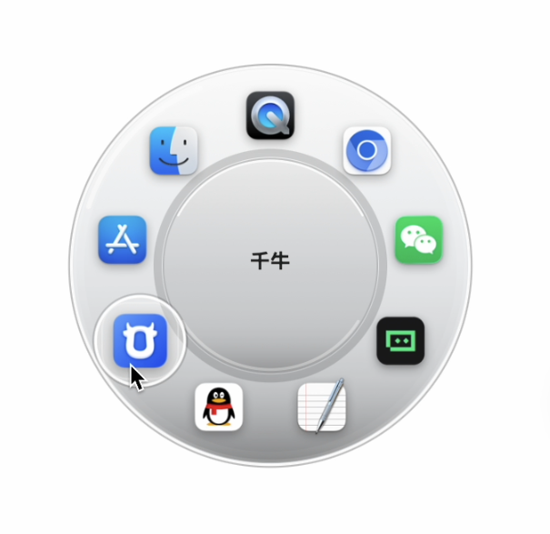
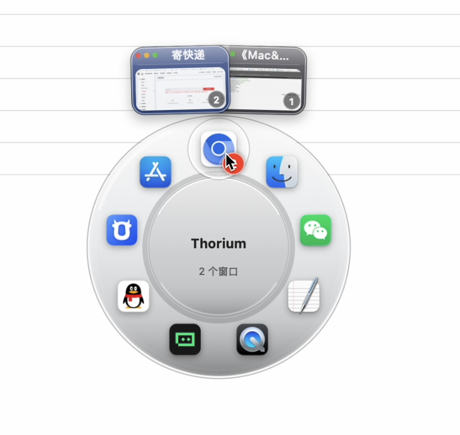
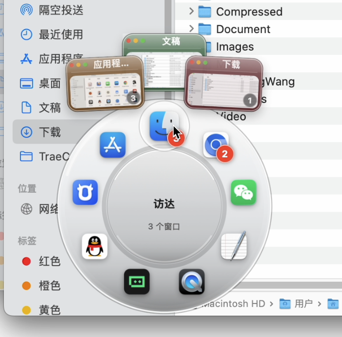

<div align="center">

# AppRing

**A radial app switcher for macOS — summon it at your cursor, flick to any app or window.**

macOS 上的环形应用切换器 —— 光标处呼出，一瞥即切。

[](#-requirements)
[](#)
[](LICENSE)

</div>

---

## English

**AppRing** replaces the linear `Cmd+Tab` switcher with a radial glass disc that
appears exactly where your cursor is. Running apps sit on an orbit in
most-recently-used order; hover to aim, release (or click) to jump. For apps with
several windows, keep hovering and a CoverFlow-style fan of **live window
thumbnails** blooms outward — pick the exact window you want in one motion.

### Features

- **Summon anywhere** — press `Cmd+Tab` or a **mouse side button**; the ring
  opens at the pointer, not the screen center.
- **Radial MRU layout** — apps are arranged most-recently-used, top = current,
  then clockwise. The disc scales to fit however many apps you have open.
- **Window-level switching** — dwell on an app with multiple windows and a fan
  of real window cards blooms out, each with a **live thumbnail**, title, and
  traffic lights. Click one to focus that exact window.
- **Instant & fluid** — no entry animation; the ring is there the moment you
  summon it. Hover highlight, halo, and thumbnails are all cached and redrawn
  only over the region that changed, so the sweep stays at 60fps.
- **Full keyboard control** — `←` `→` to move, `↑` `↓` into the window fan,
  `Enter` to commit, `Esc` to cancel. Or just use the mouse.
- **Menu-bar only** — no Dock tile, no window. Lives quietly in the menu bar.

### Screenshots

| The ring at your cursor | Window fan (browser) | Window fan (Finder) |
|:---:|:---:|:---:|
|  |  |  |

### Requirements

- **macOS 12.0+** (universal binary: Apple Silicon + Intel)
- **Accessibility** permission — required to intercept `Cmd+Tab` / side button.
- **Screen Recording** permission — required for the live window thumbnails.
  Without it, the fan still works but shows title-only cards.

AppRing prompts for both on first launch; grant them in
**System Settings → Privacy & Security**.

### Install

**Prebuilt** — download `AppRing.zip` from the [latest release](../../releases),
unzip, and open it. On first launch, allow the two permissions above.

> AppRing is ad-hoc signed, not notarized. If Gatekeeper blocks it, right-click
> the app → **Open**, or run `xattr -dr com.apple.quarantine AppRing.app`.

**Build from source**

```bash
git clone https://github.com/lrylnx/AppRing.git
cd AppRing
./build.sh          # → produces AppRing.app (arm64 + x86_64)
open AppRing.app
```

### Usage

1. Launch AppRing — a small ring icon appears in the menu bar.
2. Press `Cmd+Tab` (or click a mouse side button) to summon the ring at your cursor.
3. Hover an app icon and release / click to switch to it.
4. For a multi-window app, keep hovering until the window fan blooms, then click a window.
5. Toggle the side-button trigger or quit from the menu-bar icon.

---

## 中文

**AppRing** 用一个环形毛玻璃切换器替代传统的线性 `Cmd+Tab`。圆盘在你光标所在位置
出现，正在运行的应用按「最近使用」顺序排成一圈；鼠标指到哪个、松开即切换。对于有多
个窗口的应用，继续停留还会向外绽放出一排**实时窗口缩略图**，一步到位选中你想要的那
个窗口。

### 功能特性

- **光标处呼出** —— 按 `Cmd+Tab` 或**鼠标侧键**，圆环直接出现在指针位置，而非屏幕中央。
- **环形 MRU 布局** —— 应用按最近使用排序，顶部为当前应用、顺时针排列；圆盘大小随
  打开的应用数量自动缩放。
- **窗口级切换** —— 在多窗口应用上停留，会绽放出一排真实窗口卡片，每张带**实时缩略图**、
  标题栏和红黄绿交通灯，点一下即可聚焦到那个具体窗口。
- **瞬时流畅** —— 无开场动画，呼出即完整显示；悬停高亮、光晕、缩略图全部走缓存，且只
  重绘发生变化的区域，扫动时稳定 60fps。
- **完整键盘操作** —— `←` `→` 切换应用，`↑` `↓` 进入窗口扇形，`Enter` 确认，`Esc` 取消。
  也可以全程只用鼠标。
- **仅菜单栏** —— 无 Dock 图标、无主窗口，安静地待在菜单栏。

### 环境要求

- **macOS 12.0+**（通用二进制：Apple Silicon + Intel）
- **辅助功能**权限 —— 拦截 `Cmd+Tab` / 侧键所必需。
- **屏幕录制**权限 —— 实时窗口缩略图所必需；未授予时扇形仍可用，但只显示标题卡片。

首次启动会自动提示授权，请在**系统设置 → 隐私与安全性**中勾选。

### 安装

**预编译版** —— 从 [Releases](../../releases) 下载 `AppRing.zip`，解压后打开，
按提示授予上述两项权限。

> AppRing 为临时签名、未做公证。若被 Gatekeeper 拦截，右键应用 → **打开**，
> 或执行 `xattr -dr com.apple.quarantine AppRing.app`。

**从源码构建**

```bash
git clone https://github.com/lrylnx/AppRing.git
cd AppRing
./build.sh          # 生成 AppRing.app（arm64 + x86_64）
open AppRing.app
```

### 许可

[MIT](LICENSE)
